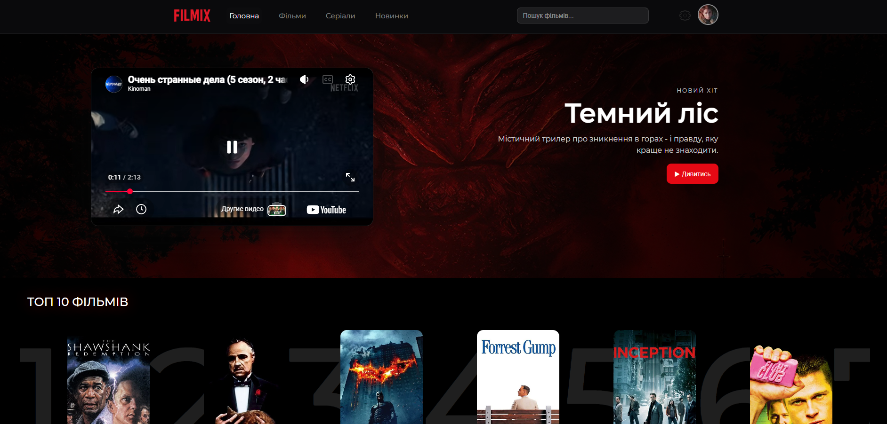
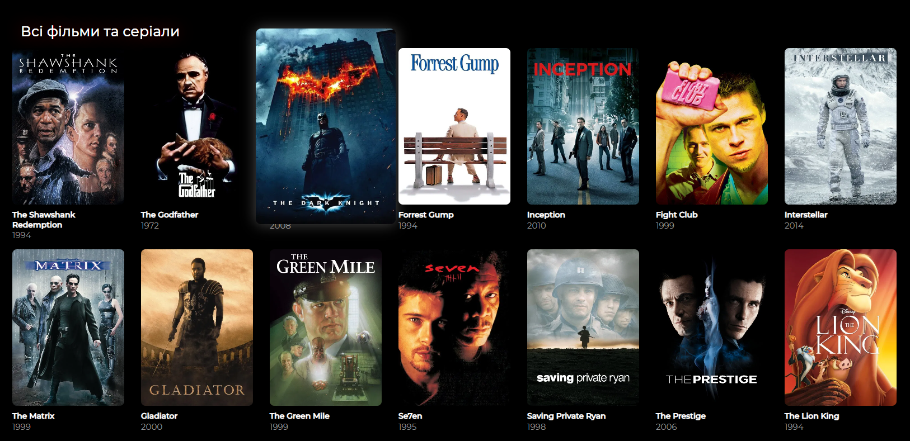
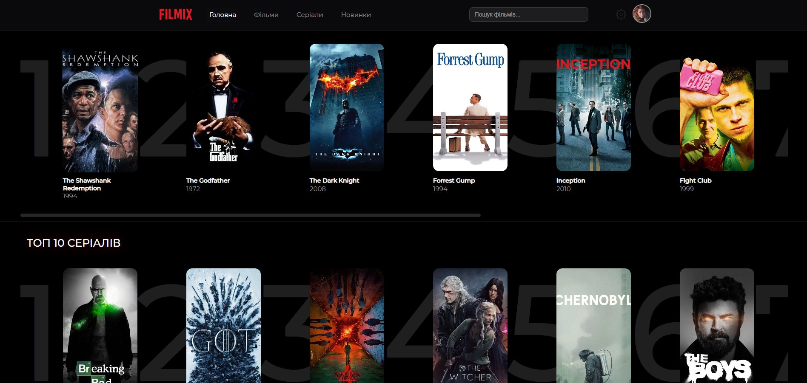
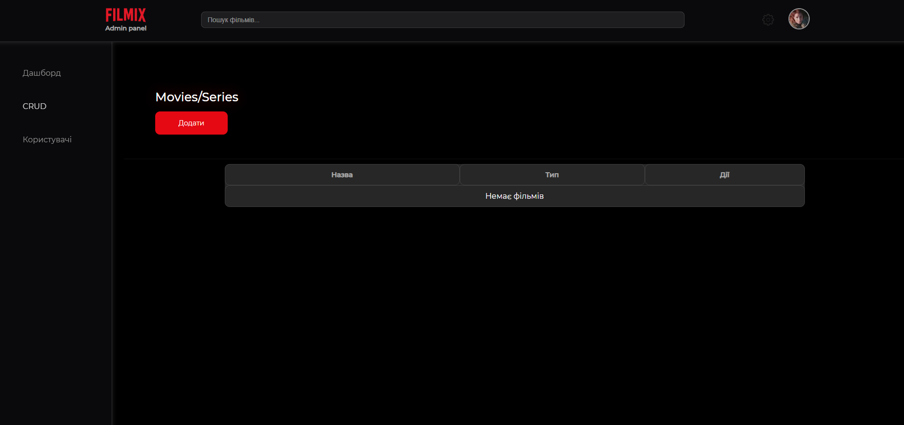
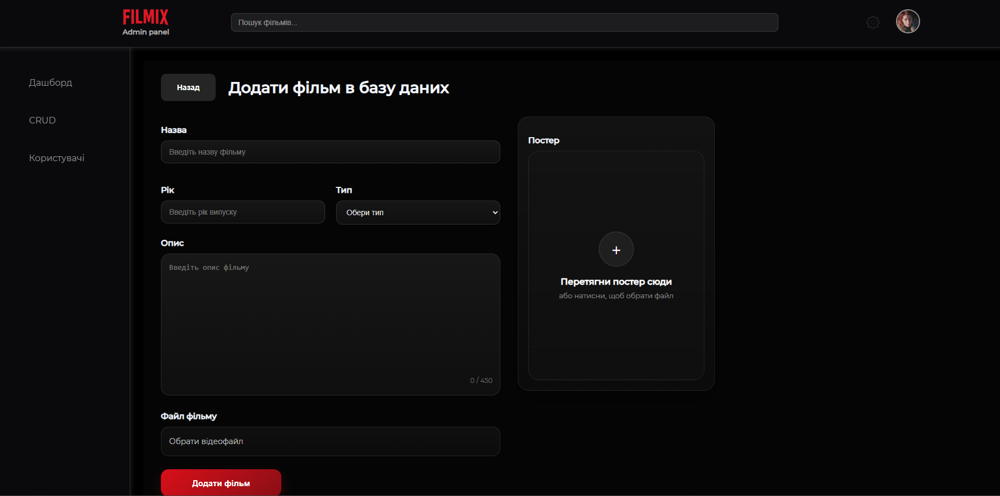
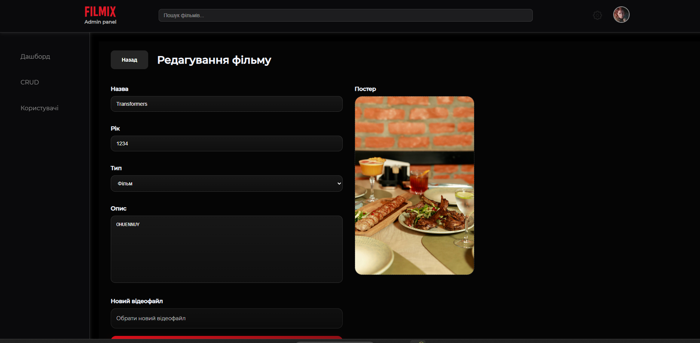

# FILMIX

Fullstack movie platform with admin panel.  
Built with **React (Vite) + Express + Prisma + MySQL**

---

## Features

–  Movies & Series catalog  
–  Movie page (to open -> click)  
–  Admin Panel (CRUD)  
–  Upload постера (drag & drop)  
–  Upload відео  
–  Edit movie (with poster preview)  
–  Delete movie (with deleting sorce file)  

---

## Tech Stack

### Frontend
- React
- Vite
- React Router

### Backend
- Node.js
- Express
- Prisma ORM
- MySQL
- Multer

---

## 📸 Screenshots

### 🏠 Home

### 🎬 Movies

### 🔝 Top Movies

### ⚙️ Admin Panel

### ➕ Add Movie

### ✏️ Update Movie

### 📂 Dropdown

---

## 📂 Project Structure

filmix/
│
├── client/        
├── server/        
│   ├── uploads/   
│   ├── prisma/    
│
└── screenshots/   

---

## ⚙️ Setup

### 1. Clone project

git clone https://github.com/AndrewBaganich/filmix.git
cd filmix

---

### 2. Install dependencies

cd client
npm install

cd ../server
npm install

---

### 3. Setup database

cd server
npx prisma generate
npx prisma db push

---

### 4. Run project

Frontend:
cd client
npm run dev

Backend:
cd server
npm run dev

---

## API

GET    /api/movies  
GET    /api/movies/:id  
POST   /api/movies  
PATCH  /api/movies/:id  
DELETE /api/movies/:id  

---

## Author

Andrew Baganich  

---
